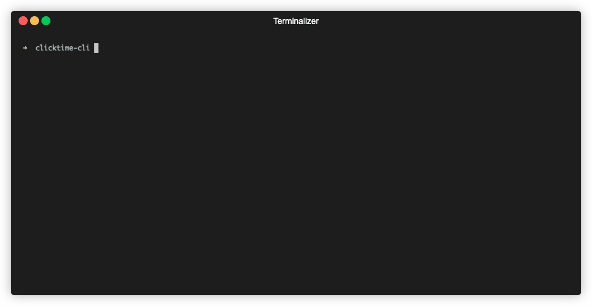

### clicktime-cli
Interactive prompt for time tracking in ClickUp

### Motivation 
Main motivation for me was to save some time

### Config 
- Get ClickUP API key: Setting -> Apps
- Get `team-id` aka `Workspace ID`: Can be accessed at any time from your URL (app.clickup.com/'workspace_id')

### Demo
